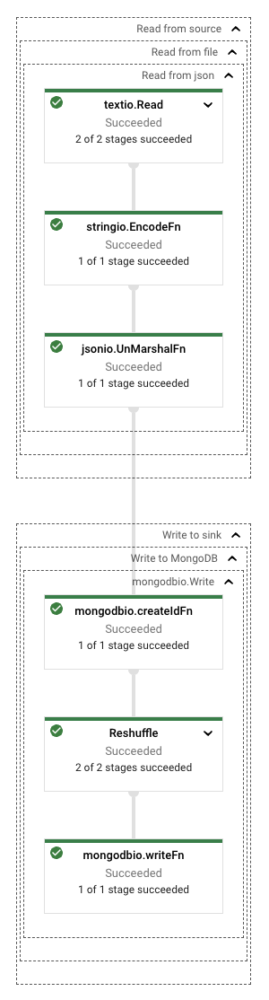

# Go Beam Pipeline

## Introduction

This project contains a pipeline and a number of IO transforms developed with the Apache Beam Go SDK. It can be run with
DirectRunner or DataflowRunner.

The pipeline reads from a source and writes to a sink. Which source and sink to use can be configured in a templated
yaml file, which is passed to the program as an argument. Example configuration is in the [config](config) folder.

Supported sources:

- BigQuery
- Cloud Storage (avro, csv, json)
- Firestore
- SQL database (postgres)

Supported sinks:

- BigQuery
- Cloud Storage (avro, csv, json)
- Firestore

The image below shows a Dataflow pipeline that reads from file/json and writes to file/csv.



## Pre-requisites

- Go version 1.16
- Gcloud SDK

## Development

### Setup

Install dependencies

```bash
go mod download
```

### Testing

Run unit tests

```bash
go test ./... -short
```

Run unit tests and integration tests

```bash
go test ./...
```

### Running with DirectRunner

Set environment variables

| Variable    | Description                                         |
|-------------|-----------------------------------------------------|
| CONFIG_PATH | Path to yaml configuration file (local or GCS path) |
| PROJECT     | GCP project                                         |
| BUCKET      | Bucket for data storage (if source or sink is GCS)  |

Run pipeline

```bash
go run main.go --configPath=${CONFIG_PATH} --project=${PROJECT} --bucket=${BUCKET}
```

## Deployment

Set environment variables

| Variable        | Description                                                                                                                                                                                                                                        |
|-----------------|----------------------------------------------------------------------------------------------------------------------------------------------------------------------------------------------------------------------------------------------------|
| CONFIG_PATH     | Path to yaml configuration file (local or GCS path)                                                                                                                                                                                                |
| PROJECT         | GCP project                                                                                                                                                                                                                                        |
| BUCKET          | Bucket for data storage (if source or sink is GCS)                                                                                                                                                                                                 |
| REGION          | Compute region                                                                                                                                                                                                                                     |
| SUBNETWORK      | Subnetwork                                                                                                                                                                                                                                         |
| SA_EMAIL        | Email of service account used for Dataflow. Needs the roles:<br/><ul><li>`roles/dataflow.worker`</li><li>`roles/bigquery.dataEditor`</li><li>`roles/bigquery.jobUser`</li><li>`roles/datastore.user`</li><li>`roles/storage.objectAdmin`</li></ul> |
| DATAFLOW_BUCKET | Bucket for Dataflow staging data                                                                                                                                                                                                                   |

### Running with DataflowRunner

```bash
go run main.go \
--configPath=${CONFIG_PATH} \
--project=${PROJECT} \
--bucket=${BUCKET} \
--runner=dataflow \
--region=${REGION} \
--subnetwork=${SUBNETWORK} \
--service_account_email=${SA_EMAIL} \
--staging_location=gs://${DATAFLOW_BUCKET}/staging \
--job_name=${JOB_NAME}-$(date +%s)
```
